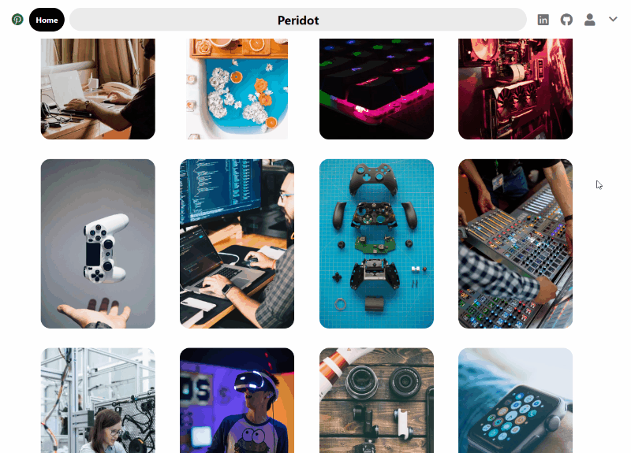
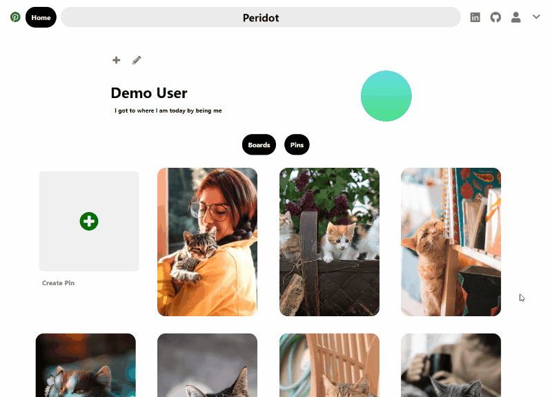
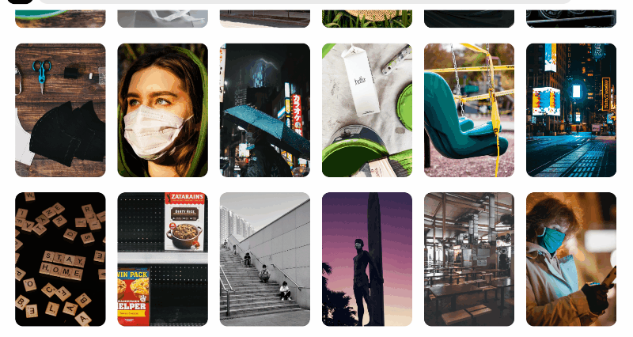
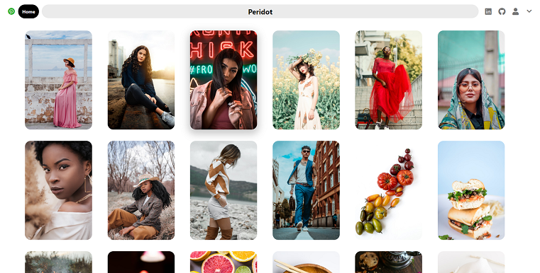

# Peridot

Peridot is a single page app inspired by Pinterest, where users can discover new ideas and inspiration through 
other users' shared images, as well as contribute their own collections.

[Visit the site](https://peri-dot.herokuapp.com/#/)

## Technologies
* Ruby on Rails
* React/Redux
* HTML/CSS/JS
* Amazon Web Services

## Features

* When viewing a pin, a suggested feed is generated below containing similar images
<p align="center">
  
</p>

* View other users' pins and add them to your own collections.
<p align="center">
  
</p>


* Create and edit your own pins and boards to save images and ideas.
<p align="center">
  
</p>

* Responsive design to aide an inviting discover feed
<p align="center">
  
</p>

## Masonry layout
* Home feed organization is paramount to the user experience. The masonry style layout must be responsive and 
    visually appealing, with columns of consistent widths and variable hieghts. The number of columns is
    caluclated from the current width of the viewport and adjust by an event listener on the window. 
    After fetching, the pins are randomized by a custom shuffling algorithm and individually assigned to a column. 
    CSS flexbox and animations are used to display the image upon loading.

<p align="center">
  
</p>

## Discover feed suggestions
* Discovering new ideas is easier when you can view other images related to the ones you like.
    When viewing individual pins, frontend filters generate a suggested feed of similar pins.
    To implement this, selectors populate the components with pins of the same category 
    and check user ownership to ensure unique and unsaved pins are displayed.

```
export const selectSuggestedPins = (pins, userId, pinId) => {
    //select based on category, ignore currently viewed pin
    let suggestedPins = [];
    Object.values(pins).forEach( pin => {
        if (pin.id === pinId) return;
        if ((pin.userId !== userId) && (pin.category === pins[pinId].category)) suggestedPins.push(pin);
    })
    return suggestedPins;
};
```

## Coming soon
* Lazy loading images
* Search bar