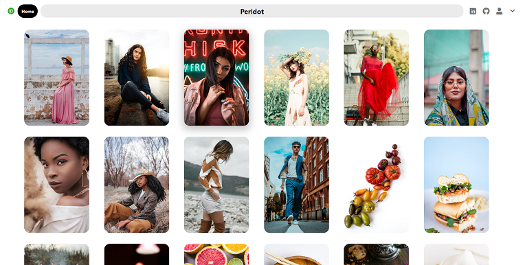
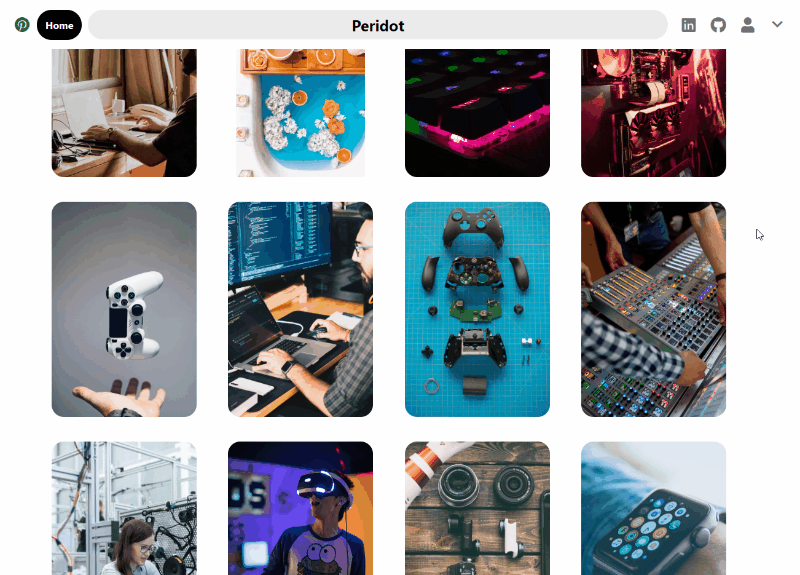
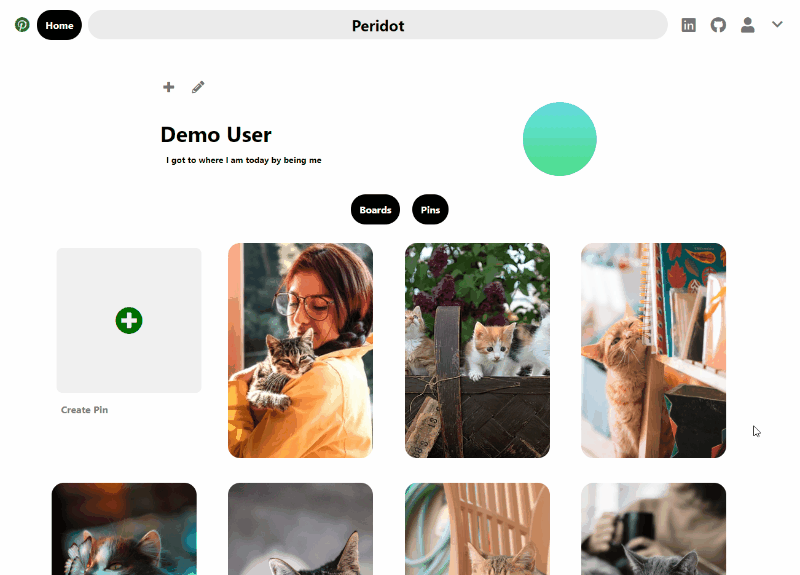
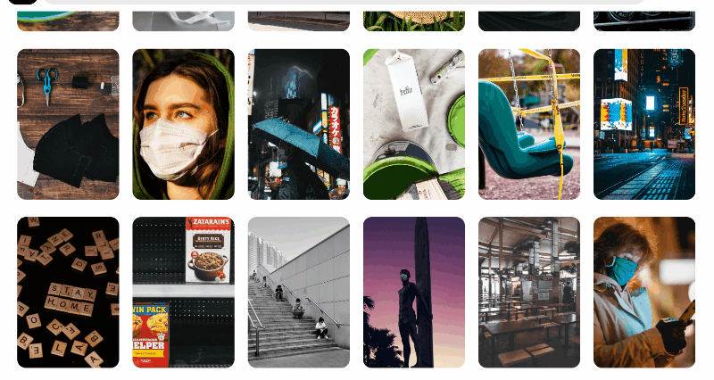

# Peridot

Peridot is a single page app inspired by Pinterest, where users can discover new ideas and inspiration through
other users' shared images, as well as contribute their own collections.

<!-- [Visit the site](https://peri-dot.herokuapp.com/#/) -->

- [Technologies](#technologies)
- [Features](#features)
- [Contributing](#contributing)

<br/>

<p align="center">
  
</p>

## Technologies

- Ruby on Rails
- React/Redux
- HTML/CSS/JS
- Amazon Web Services

## Features

### Discover feed suggestions

- When viewing a pin, a suggested feed is generated below containing similar images
  <p align="center">
  
  </p>
- Frontend filters generate the suggested feed. Selectors populate the components with pins of the same category and check user ownership to ensure only unique and unsaved pins are displayed.

    ```javascript
    export const selectSuggestedPins = (pins, userId, pinId) => {
    	let suggestedPins = [];
    	Object.values(pins).forEach((pin) => {
    		if (pin.id === pinId) return;
    		if (pin.userId !== userId && pin.category === pins[pinId].category) suggestedPins.push(pin);
    	});
    	return suggestedPins;
    };
    ```

### View other users' pins and boards or create your own

- View an assortment of other users' pins and add them to your own collections.
  <p align="center">
  
  </p>

- Create and edit your own pins and boards to save and organize your ideas.
  <p align="center">
  
  </p>

### Masonry layout

- After fetching, pins are randomized with a shuffling algorithm and individually assigned to a column.
  The number of columns is caluclated from the current width of the viewport and updated by an event listener on the window. CSS flexbox and animations are used to display the image upon loading.
  <p align="center">
  
  </p>

## Contributing

### Local Development

1. Clone this repo to your local machine
2. Install dependencies: `bundle install && npm install`
3. Setup the database: `bin/rails db:setup`
4. In one terminal, start the Rails server: `bin/rails s`
5. In another terminal, start webpack: `npm start`
6. Visit `http://localhost:3000` in your browser
